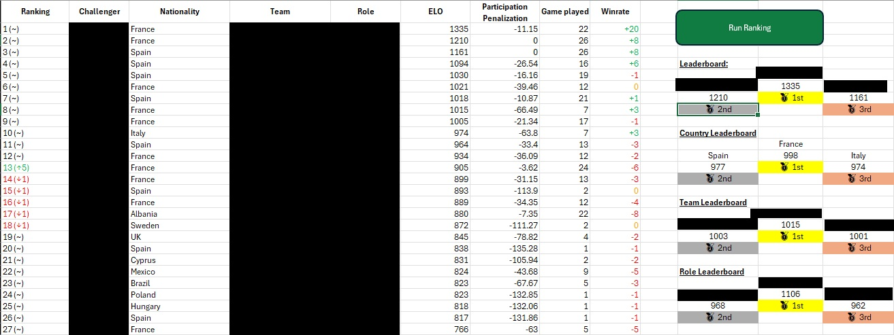
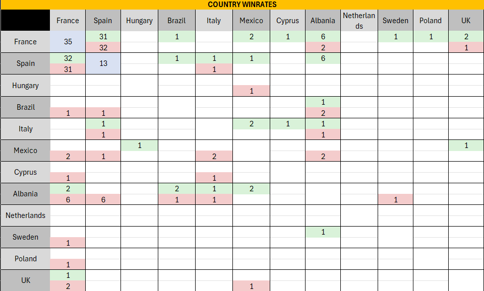

# 🏆 Excel ELO Ranking System

A fully automated ranking engine built inside Excel using **Office Scripts**.  
If you run games, competitions, or challenges and want an evolving, fair, transparent ranking… this tool is for you.
It’s built to be **plug‑and‑play**, highly robust, and friendly even for people who have never used scripts before.

***
## Excel table tennis league 

We developped it for our office's games of table tennis. 
We run and compete to be the best player of this tennis table league on Excel thanks to this Office Script.
It stays collaborative and intuitive as every participant can fill the match log with their recent game and then see the update by running the script.

***

# 🌟 What this system does

### ✔ Automatically computes ELO ratings

Every time you run the script, it processes all recorded matches and updates every player’s rating using a modernized Elo system with:

*   margin‑of‑victory factor
*   participation penalization (fairness boost for active players)
*   win/loss differential
*   rank change indicator (↑ ↓ \~)

### ✔ Maintains a full leaderboard

The “Leaderboard” sheet displays for every player:

*   Rank
*   Rank change since previous update
*   Name
*   Nationality / Team / Role
*   Number of games played
*   Penalty points (if inactive)
*   Final ELO
*   Win/Loss differential (+X / -X)

### ✔ Automatically detects game winners

No formulas needed. You only input:

*   Player A
*   Player B
*   Score A
*   Score B

The script infers the winner each time.

### ✔ Creates and maintains 3 Winrate Matrices

The script generates and updates:

*   **Country vs Country**
*   **Team vs Team**
*   **Role vs Role**

Including:

*   wins
*   losses
*   color coding
*   games played per category
*   automatic layout creation based on Challenger Cards sheet

Note: Grid Layout is not drawn by the script.

### ✔ Beautiful podium views

The “Leaderboard” sheet contains ready‑to‑use podium sections:

*   🥇 Top 3 Players
*   🌍 Top 3 Countries
*   🛡 Top 3 Teams
*   🎭 Top 3 Roles
*   💩 The bottom player (fun addition)

Titles like **Leaderboard**, **Country Leaderboard**, etc., are automatically inserted.

### ✔ Self‑healing workbook

On every run, the script ensures:

*   required sheets exist
*   they appear in the correct order
*   required headers exist
*   winrate matrices are properly structured
*   player information is complete
*   the Winner column is automatically filled
*   no user formulas are required

Even if users create their own copies, **the script fixes the workbook for them**.

***

# 📁 Workbook structure (automatically enforced)

The script ensures the sheets appear in this order:

1.  **Leaderboard**
2.  **Matches Log**
3.  **Winrates**
4.  **Challengers cards**
5.  **Definition** *(reserved for future configuration)*

If any sheet is missing, it is created.

***

# 🧠 How the ELO system works (in simple words)

The engine reads every match chronologically and updates ratings based on:

    ExpectedScore = 1 / (1 + 10^((Rb - Ra) / 400))
    EloChange     = K × MarginFactor × (ActualScore - ExpectedScore)

Where:

*   **K = 32**
*   **MarginFactor = 1 + 0.5 × log2(1 + |score difference|)**
*   **ActualScore = 1 for win, 0 for loss**

A participation penalty adjusts the final rating for players who played fewer games than others, rewarding activity while preserving fairness.

Finally, rankings are computed twice:

*   once using **all matches**
*   once using matches **up to the second latest date**

This is how the script computes **rank change (↑ ↓ \~)**.

***

# 🚀 Getting Started

## 1) Open the Excel workbook

This can be:

*   Excel for the Web (recommended)
*   Excel for Desktop **with Office Scripts enabled**

## 2) Go to **Automate → Code Editor**

If not, create a new script and paste the full code inside.

## 3) Click **Run**

That’s it. The script will:

*   validate the workbook
*   build missing sheets
*   add required headers
*   compute winners
*   compute ELO
*   update leaderboard
*   update podiums
*   rebuild winrates matrices
*   apply formatting
*   re‑order sheets

Everything updates automatically.

A **button** running the script can be added to the excel sheet you want to run it more easily.

***

# 📝 How to record a match

Go to **Matches Log**, then fill:

| Column | Meaning                  |
| ------ | ------------------------ |
| A      | Date (Excel date)        |
| B      | Player A                 |
| C      | Player B                 |
| D      | Score A                  |
| E      | Score B                  |
| F      | Winner (**auto filled**) |

For example:

| Date       | Player A | Player B | A  | B  |
| ---------- | -------- | -------- | -- | -- |
| 2026‑02‑15 | Alice    | Bob      | 21 | 18 |
| 2026‑02‑15 | Charlie  | Diana    | 12 | 21 |

Do NOT fill the Winner column — the script handles it.

***

# 🧩 Adding or modifying players

Open **Challengers cards**, then fill:

| Player | Nationality | Team        | Role     |
| ------ | ----------- | ----------- | -------- |
| Alice  | France      | Blue Wolves | Striker  |
| Bob    | Spain       | Red Foxes   | Defender |
| …      | …           | …           | …        |

The Winrates sheet will automatically adapt to these values.

***

# 🎉 Why this tool is awesome

*   **Perfect for office competitions**
*   **No formulas required**
*   **Zero Excel knowledge needed**
*   **Fully automated**
*   **Resilient to user mistakes**
*   **Fun visualizations**
*   **Accurate and fair ranking logic**

If you want a system that “just works” and stays clean even when shared between many people — this is exactly that.

***
